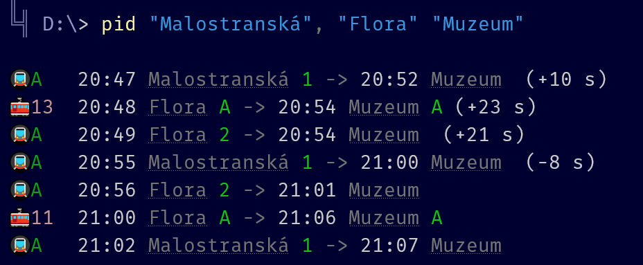

# PSPid

PowerShell client for the Golemio API for the Prague public transport network.

## Installation

Clone this repository to a directory that's in your `$env:PSModulePath`. Note that the cloned directory **must be called `PSPid`**, which is also the module's name.

```
git clone https://github.com/MatejKafka/PSPid
```

Now, the module should be importable by calling `Import-Module PSPid`, or just invoking one of the exported functions.

## Usage

Main command is `Get-PidTrip` (also available using the `pid` alias), which expects two arguments and lists **direct connections** between the specified stops:

- `-From`: An array of stop names to search from.
- `-To`: An array of stop names to search to.

If a vehicle is passing through more than two of the specified stops, the earliest origin stop and the latest destination stop is shown (the expectation is that if you're entering multiple stops, you prefer the earliest one because why else would you specify multiple stops?).

To show all of the specified stops the vehicle passes through, pass the output of `pid` through `Format-PidTrip -AllStops`.

If the cmdlet returns none or too few results, raise the limit on the number of listed departures by passing `-Limit <n>`. By default, the API only returns 100 departures for the specified stations, which may not be enough for popular or distant stations. From my limited testing, `-Limit 500` seemed enough to get at least one connection between any two stops in Prague.

## Example


